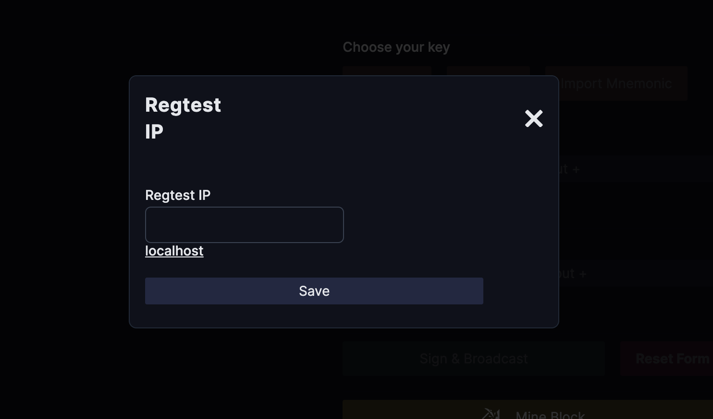
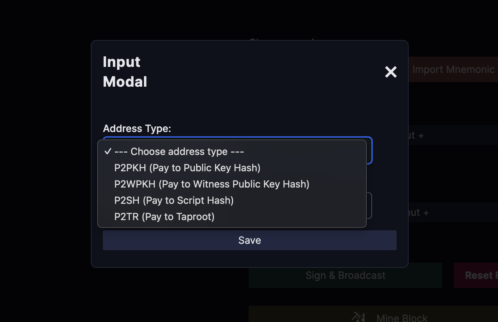
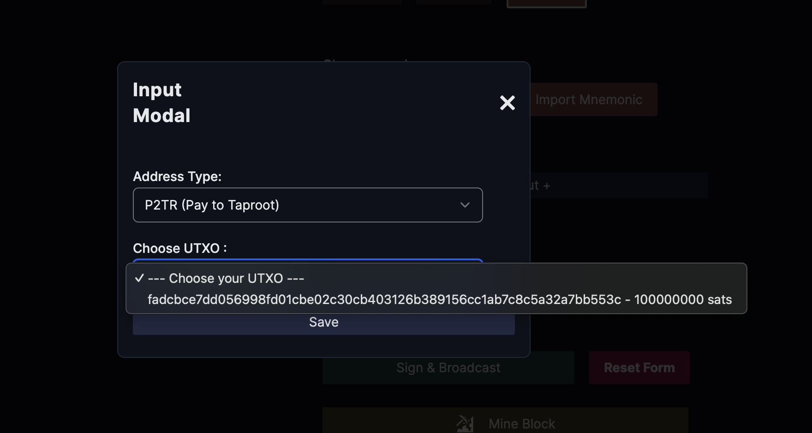
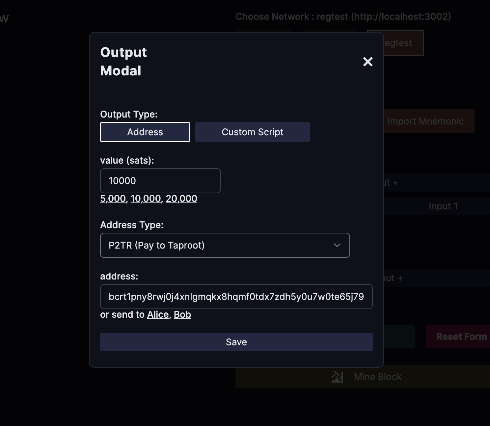
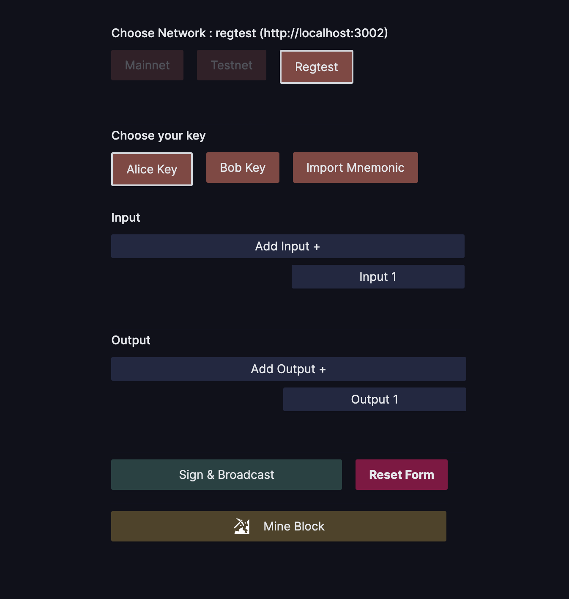

## Usage

In this section, you will learn how to use the East PSBT UI Builder.

First, choose the network you want to use. Currently, we only support the regtest network, but testnet and mainnet will be available soon.

In the section <b>Choose your network</b>, click the <b>Regtest</b> button to open a modal to input your regtest URL that has been set up in the <a href="/prerequisites"><b>Prerequisites</b></a> step previously.
If you followed the tutorial, then the URL should be <b>http://localhost:3032</b> for the regtest network, or you can click the shortcut <b>localhost</b> beneath the input and then click <b>Save</b>.

 

Next, choose which wallet you'll be using. You can select the pre-loaded <b>Alice's</b> or <b>Bob's</b> wallet, or import your own Mnemonic Phrase. 
(We recommend using the pre-loaded wallet as it already has UTXOs inside.) In this example, we'll use <b>Alice's</b> key by clicking the <b>Alice Key</b> button.

 

Now that we have an active wallet, the <b>Add Input</b> and <b>Add Output</b> buttons should be enabled.
Click the <b>Add Input</b> button to open a modal for creating our PSBT input.

You need to choose which address type to use for this input. We support <b>P2PKH</b>, <b>P2WPKH</b>, <b>P2SH</b>, and <b>P2TR</b> address types.
In this example, we will use a <b>P2TR</b> address

After that, choose which UTXO to use for the input. Click the <b>Choose UTXO</b> button to see a list of UTXOs (txid and value in sats).

 

Now that the input is done, we can create the output. Click the <b>Add Output</b> button to open a modal for creating a PSBT output. 
You can choose to send your output to an Address or a Script. 
In this example, we'll create an output for an Address. Choose the address type for your output and specify how many sats will be sent. 
You can fill in the value and address as you like or use the shortcut button provided.

 

In this example, we created only 1 input and 1 output. 
You can experiment with different numbers, but for simplicity, we'll keep it this way. 
We've created everything needed for a PSBT to be signed and broadcasted, so let's do that now. 
Click the <b>Sign & Broadcast</b> button

 

Everything else is disabled except for the **Choose your network** section. 
Go ahead and click the **Regtest** button, it will show you a modal where you can input the regtest url that you have created on the [Prerequisites](/prerequisites) page.

// Gif showing cursor click Regtest button and paste the regtest url

After that, another button will be enabled on the **Choose your key** section.

// Image showing button keys enabled

You can choose pre-existing key (Alice, Bob) or you can import your own Mnemonic phrase by clicking the **Import Key** button